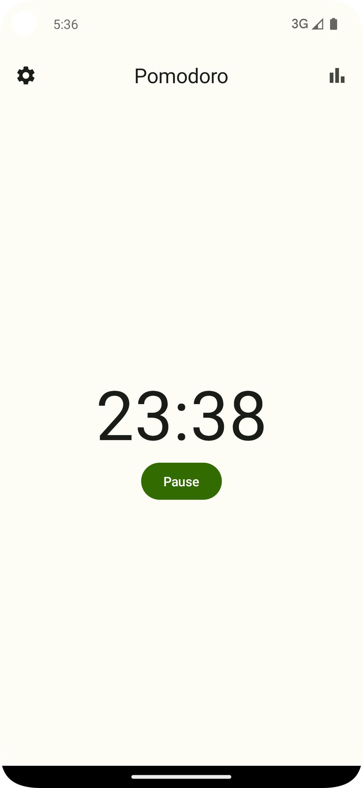
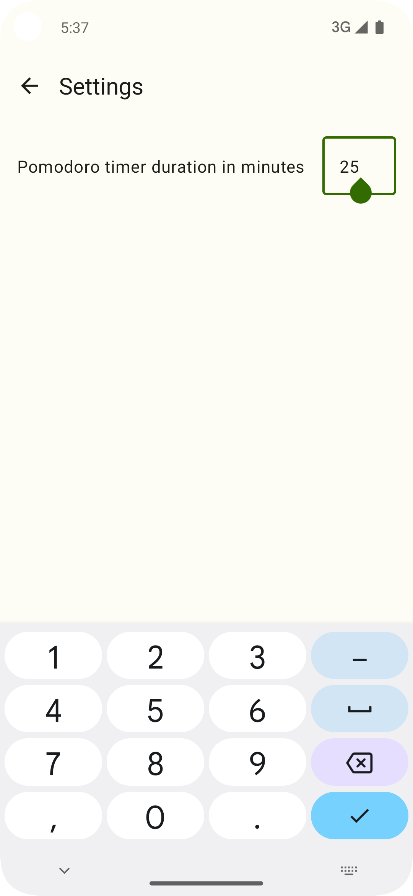
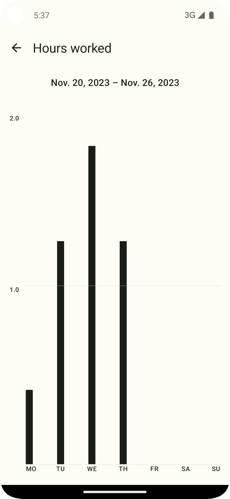
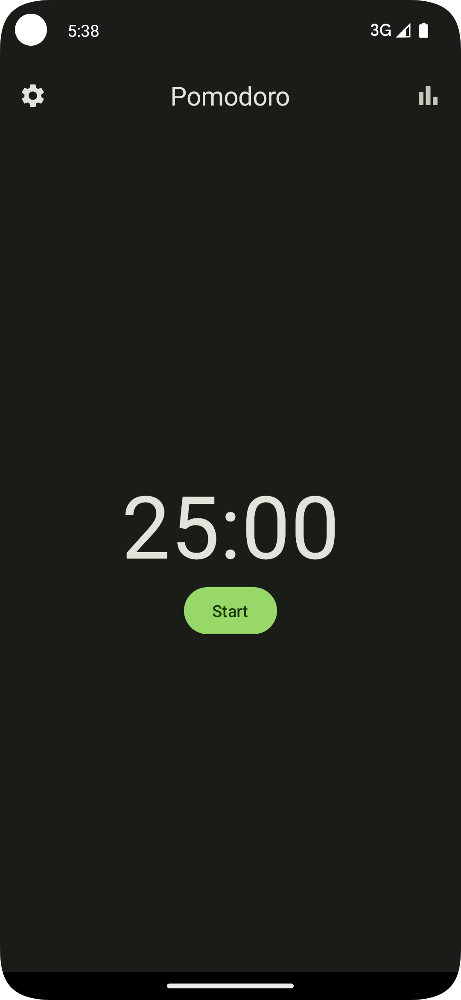

# Compose Multiplatform Pomodoro Timer
A Kotlin Multiplatform pomodoro timer App for Android and iOS, having a shared UI written with Compose Multiplatform.

## Features
- Start, pause and stop pomodoro timer.
- Set pomodoro timer duration
- View statistics on hours worked per week.
- Get a notification when the timer is up (on Android, additionally a sticky notification is shown showing the current timer status while the App is in the background).

## Tech-stack
- [SQLDelight](https://github.com/cashapp/sqldelight) database (SQLite) for storing the work packages.
- [Multiplatform Settings](https://github.com/russhwolf/multiplatform-settings) for storing the app settings like the pomodoro timer duration.
- [Compose Multiplatform](https://github.com/JetBrains/compose-multiplatform) for creating a shared UI.
- [Moko Resources](https://github.com/icerockdev/moko-resources) for sharing localized strings.
- [Voyager](https://github.com/adrielcafe/voyager) navigation library for Compose Multiplatform.
- [Koin](https://github.com/InsertKoinIO/koin) dependency injection framework.
- [Kermit](https://github.com/touchlab/Kermit) Kotlin Multiplatform logging utility.
- [Compose Multiplatform Chart](https://github.com/maximilianproell/compose-multiplatform-chart) library for the bar chart statistics.

## Screenshots

  
   
   
   

